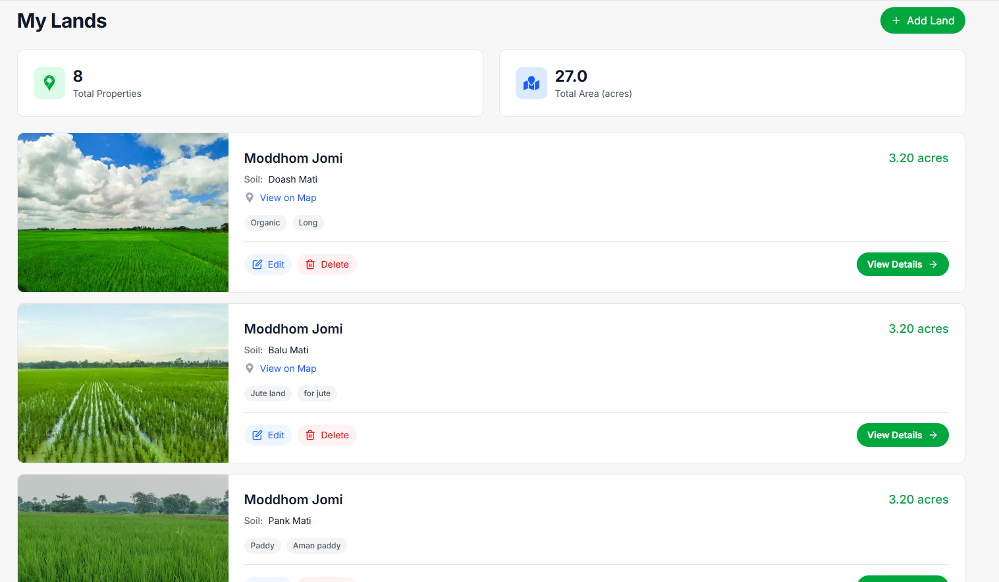
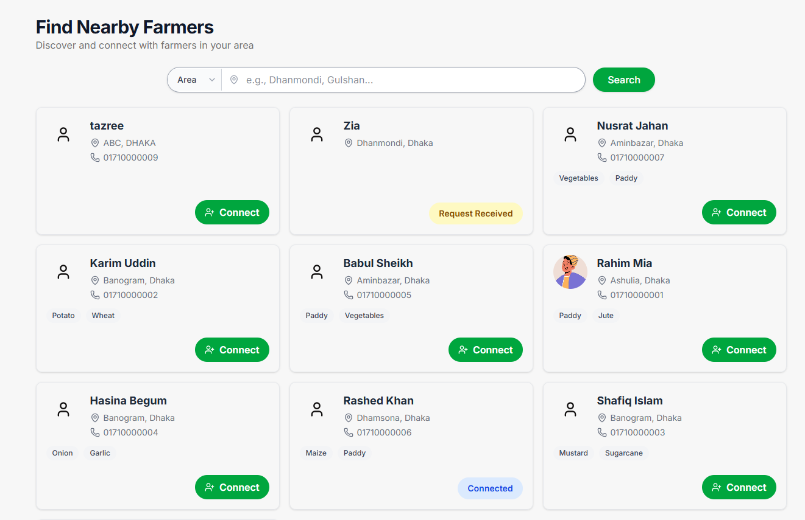
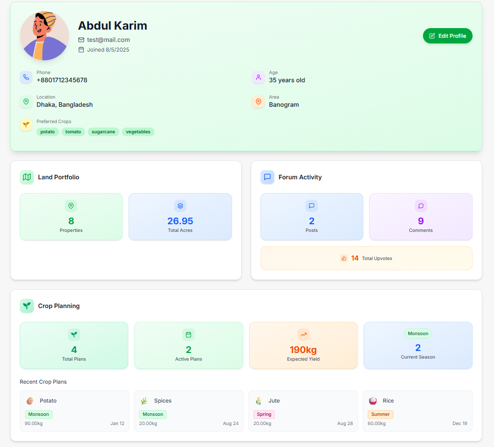

# 🌾 Agrosphere - Smart Farming Companion

**Agrosphere** is a comprehensive digital farming platform that empowers farmers with modern tools for land management, crop planning, financial tracking, and community networking. Built with Next.js and modern web technologies, it provides an all-in-one solution for agricultural management.

## 🚀 Features

### 🌱 **Land Management & Tracking**

- Add and manage agricultural properties with area, soil type, and location data
- Real-time land statistics and analytics dashboard
- AI-powered crop recommendations based on soil quality

- Visual performance metrics and crop records integration
- GPS mapping and location-based insights

### 📊 **Crop Planning & Management**

- Create seasonal crop plans with planting schedules and yield predictions
- Browse public crop database and learn from other farmers
- Weather-integrated planning for informed decisions

### 💰 **Financial Management**

- Track and categorize farming expenses with profit/loss analysis
- Budget planning and financial reporting

- Manage agricultural loans with payment schedules and reminders
- Visual loan analytics and status tracking

### 🤖 **AI-Powered Assistant**

- Get instant expert advice on crops, soil health, pest control, and livestock
- Personalized farming recommendations based on your land data
- 24/7 support with multi-language capabilities

### 🏪 **B2B Marketplace**

- Buy and sell crops, equipment, and farming supplies
- Real-time market prices and supplier network
- Rating system for reliable transactions

### 👥 **Community & Networking**

- Connect with nearby farmers and agricultural experts
- Knowledge sharing forum for questions and experiences
- Find local farmers and exchange farming practices

### 👤 **Profile Management**

- Maintain detailed farmer profiles with contact info and preferences
- Track achievements and showcase your farming portfolio
- Privacy controls and professional networking

## 🔧 **Technology Stack**

- **Frontend**: Next.js 15, React 19, JavaScript
- **Styling**: Tailwind CSS, ShadCN UI Components
- **Database**: PostgreSQL
- **Authentication**: Custom JWT-based authentication
- **AI Integration**: OpenAI API for chatbot and recommendations
- **Image Storage**: Cloudinary for image management
- **Deployment**: Vercel

## 🌟 **Test Account**

You can try Agrosphere using our test account:

**Email**: `test@mail.com`  
**Password**: `test@mail.com`

##  **Getting Started**

1. Clone the repository
2. Install dependencies: `npm install`
3. Set up environment variables
4. Run the development server: `npm run dev`
5. Visit `http://localhost:3000` to access the platform

---

**Agrosphere** - Empowering farmers with technology for sustainable and profitable agriculture. 🌾✨
